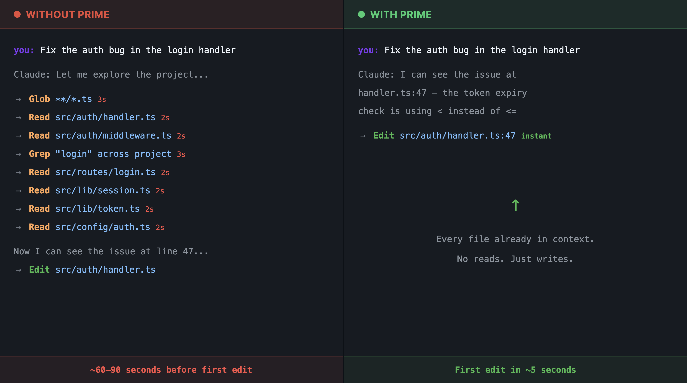

# Prime

**Claude Code, but it already knows your codebase.**

1. **One command** — your entire codebase lands in Claude's context window, line-numbered and citeable
2. **Zero reads for the entire session** — not just the first edit. Claude never calls Read/Grep/Glob on code it already has
3. **One launch command per project** — alias each project to its own instant-on Claude session

```
$ prime my-app
priming: My App
  path: ~/code/my-app
  files: 47
  chars: 892,340
  ~tokens: 223,085

  Ready. All files pre-loaded with line numbers.
```

## The problem

Every Claude Code session starts the same way: Claude is blind. It doesn't know your project. So it explores — Glob to find files, Read to see them, Grep to search them. **1-2 minutes and dozens of tool calls before it writes a single line of code.** And it doesn't stop there. Every new prompt triggers more reads. A 20-edit session burns 60+ tool calls just discovering code that could have been in context from the start.

This is the #1 source of wasted time, wasted tokens, and wasted context window in Claude Code.

## The fix

The 1M context window changed everything. Most codebases fit entirely in context. Prime exploits this: **load everything upfront, skip the discovery phase entirely.**



## What changes

**The entire session — not just the first edit.**

| | Without Prime | With Prime |
|---|---|---|
| First prompt | 60-90s of Read/Grep/Glob | Immediate edit |
| Every prompt after | More reads, more exploration | Immediate edit |
| Tool calls per session | 60-100+ (mostly reads) | Only edits and verification |
| Context window | Fills with Read results (uncached) | Code lives in cached system prompt |
| Cost per turn | Every Read = fresh input tokens | Code is cached after turn 1 |
| Session length | Dies early from context bloat | Stays lean, lasts longer |
| Failure mode | Exploration spiral (reads 15 wrong files) | Impossible — everything is visible |

**Create a launch command for each project:**

```bash
# ~/.zshrc or ~/.bashrc
alias api="prime api-server"
alias web="prime frontend"
alias ml="prime ml-pipeline"
```

One word. Full awareness. Every project gets its own instant-on Claude session.

**Commit `.primerc` to your repo.** Everyone on the team gets identical context — same files, same line numbers, same starting point.

## Install

```bash
git clone https://github.com/krushr1/prime.git
cd prime
bash install.sh
```

Installs to `~/.prime/` (config) and `~/.local/bin/prime` (command).

Make sure `~/.local/bin` is in your PATH:
```bash
export PATH="$HOME/.local/bin:$PATH"  # add to .zshrc / .bashrc
```

**Requirements:** Python 3, [Claude Code CLI](https://docs.anthropic.com/en/docs/claude-code)

## Quick Start

### Option A: Per-project config (`.primerc`)

```bash
cd ~/code/my-project
prime --init     # scans for source files, creates .primerc
prime .          # launch Claude with full context
```

The `.primerc` file is just JSON — edit it to control exactly what gets loaded:

```json
{
  "name": "My Project",
  "key_files": [
    "package.json",
    "src/**/*.ts",
    "src/**/*.tsx"
  ],
  "extra_files": [],
  "skill_file": "",
  "max_tokens": 300000
}
```

Commit `.primerc` to your repo so your whole team gets instant context.

### Option B: Central registry

For managing multiple projects from one place:

```bash
# Edit the registry
vim ~/.prime/projects.json

# Launch any project by name
prime my-app
prime "api server"
```

Names are fuzzy-matched — dashes and spaces are interchangeable. `prime api` matches "API Server".

## Config Reference

### `.primerc` / `projects.json` fields

| Field | Required | Description |
|-------|----------|-------------|
| `path` | yes* | Project root directory. In `.primerc`, defaults to the directory containing the file |
| `key_files` | yes | Files to preload. Relative to `path`. Supports globs (`src/**/*.ts`) |
| `name` | no | Display name. Defaults to directory name |
| `stack` | no | Technology label (cosmetic, shown in `--list`) |
| `extra_files` | no | Absolute paths to files outside the project (shared protos, configs, etc.) |
| `skill_file` | no | Path to a SKILL.md or instructions file, loaded first for workflow context |
| `max_tokens` | no | Warn if context exceeds this token count |

*Required in `projects.json`. Optional in `.primerc` (defaults to current directory).

### Glob support

`key_files` supports standard glob patterns:

```json
{
  "key_files": [
    "package.json",
    "src/**/*.ts",
    "src/**/*.tsx",
    "prisma/schema.prisma",
    "tests/**/*.test.ts"
  ]
}
```

## Commands

| Command | Description |
|---------|-------------|
| `prime <project>` | Build context and launch Claude Code |
| `prime .` | Use `.primerc` in current/parent directory |
| `prime --init` | Create `.primerc` by scanning current directory |
| `prime --scan` | Preview what `--init` would detect (no files written) |
| `prime --list` | List projects in central registry |
| `prime --dry-run <project>` | Show file/token count without launching |
| `prime --version` | Show version |

## How It Works

1. **`prime my-app`** calls `prime_build.py` with the project name
2. The builder finds the project config (`.primerc` or `projects.json`)
3. Every listed file is read from disk and **line-numbered** (5-digit prefix, 1-indexed)
4. All files are concatenated into a single text blob at `/tmp/prime-{slug}.txt`
5. Claude Code launches with `--append-system-prompt-file` pointing to that file
6. The entire codebase is injected into the system prompt **before the conversation starts**
7. Claude can immediately cite any line in any file — no tool calls needed

### Line numbering

Every file looks like this in context:

```
### src/auth/handler.ts (156 lines)
    1	import { NextRequest } from 'next/server'
    2	import { verifySession } from '../lib/session'
    3
    4	export async function handleAuth(req: NextRequest) {
    5	  const token = req.headers.get('authorization')
  ...
```

Claude sees `handler.ts:47` as a direct reference it can read and cite.

## Token Budgets

Know your limits:

Prime is built for the 1M context window. Use `prime --dry-run` or `prime --scan` to check your project fits.

Rule of thumb: **1 token ≈ 4 characters**. A 200-file TypeScript project with an average of 100 lines per file is roughly 200K tokens — well within budget.

## Tips

- **Start with `--init` + `--dry-run`** to see what fits before committing to a config
- **Use globs** to grab entire directories without listing every file
- **Trim aggressively** — you don't need test fixtures, generated code, or lock files in context
- **`extra_files`** is great for shared schemas, API specs, or reference data from other repos
- **`skill_file`** loads first — use it for workflow instructions, coding standards, or project-specific rules
- **Commit `.primerc`** to your repo so teammates get the same context

## Project Structure

```
prime/
├── bin/prime              # Shell entry point (dev mode)
├── lib/prime_build.py     # Context builder
├── templates/
│   ├── projects.json.example
│   └── primerc.example
├── install.sh
├── uninstall.sh
├── README.md
└── LICENSE
```

After install:
```
~/.prime/
├── prime_build.py         # The builder
└── projects.json          # Central project registry

~/.local/bin/
└── prime                  # The command
```

## Uninstall

```bash
cd prime
bash uninstall.sh
```

Removes the command and builder. Keeps `~/.prime/projects.json` (your configs).

Full removal: `rm -rf ~/.prime`

## License

MIT
